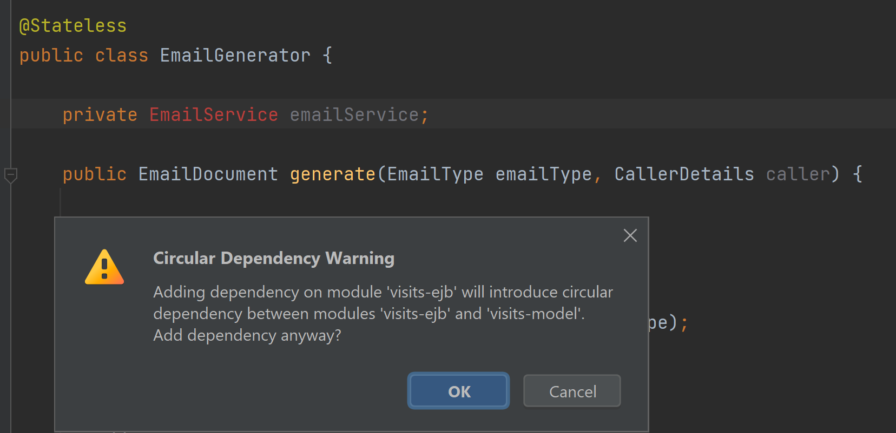

## 10th April

I have moved to a new project
My reasoning for this is that I want to create an end-to-end
proof of concept

My starting point is to create a Spring MVC:
https://spring.io/guides/gs/rest-service

I'm following the guidance set out in the instructions given
in the link above

## 11th April
Study day. Working to get this proof-of-concept complete.
Managed to get the Maven issues that I was having fixed.
I switched from Maven wrapper to Maven Bundle

Got a server exception when retrieving the email data.
Hopefully, this will fix it:
https://stackoverflow.com/questions/51004447/spring-boot-java-awt-headlessexception
That worked! :+1:

Might be good to design some kind of "Thank you" page so that there's not just a blank space

I was debugging as I was getting a 404, then a 500.
Turns out, I was using @PathParam instead of @PathVariable.
I'd checked that the enum conversion was correct. It was.

https://stackoverflow.com/questions/41657428/getting-null-with-pathparam-and-requestmapping

## 12th April
My plan today is to get something in Freemarker working.
First, I am going to do some templating. Create the .ftp files and then go from there

## 13th April
Currently, I am working on what I had set out to complete yesterday
My plan is to create a demo of my work in the design review.
Then, once this is approved, I will modify my designs further to reflect what I have implemented

It is hoped that after a successful design review on the 15th, I can develop the actual code on `#1548`

My current approach is to recreate the environment from scratch in my own sandbox
Then, I can work out how it works and what I can do.

A lot of the code which I am copying over seems to be deprecated. I need to figure out what the latest version of the code is.
To do this, I need to work out what the existing code is doing and then find code that fulfils the same functionality.

Looking at the existing code, it appears to make use of `BasicPersonDetailsDTO`. If I can use this in my project, then that would really help.

I also need to consider this method in the visit session bean: `sendRequestSummaryEmails`

## 15th April
Very frustrated. Getting a stumbling block.
Trying to work through it

Using this as reference: https://tecadmin.net/resolvee-maven-error-invalid-target-release-17/

Nothing seems to fix the issue: `java: error: invalid source release: 17`

I've tried invalidating caches. I've tried changing the system environment variables.
I've even tried changing the Maven wrapper config thing, but it doesn't work

Going to work on refining the design. Added a BasicPersonDetails service to retrieve fake information.

Refactoring so that the service retrieves the email. Adding the freemarker logic to the email generator: this makes sense to do this, as it will be possible to retrieve raw data.

Thinking that it might be possible to use Freemarker for PDFs too.
This is something that I'd like to explore.

However, this would mean that I could think about reverting to the old format of having a `Document` class

I think that I managed to get the release issue fixed. However, I am trying to figure out how to fix an issue with DGM methods
A garbage collection method is being called, even though it has been deprecated. I cannot remove it from the file because it is from `Object.java` and is readonly.

## 16th April
Still working through the issue. We've tried changing the version a few times but this ends up breaking other code (such as instances where I have enhanced switch statements).

Now trying to translate my work onto a feature branch in the codebase.
Going well so far, though my earlier work means a lot has to be changed.

It looks likely that I'm going to have to address the circular dependency in my design:

I think that the resource itself uses the EJB, which is why there weren't any problems.
I need to figure out a way of loading in the information from `EmailService` into the project

Ultimately, I want to be able to call the generate body methods from `EmailService` in my code, which is in `visits-model`